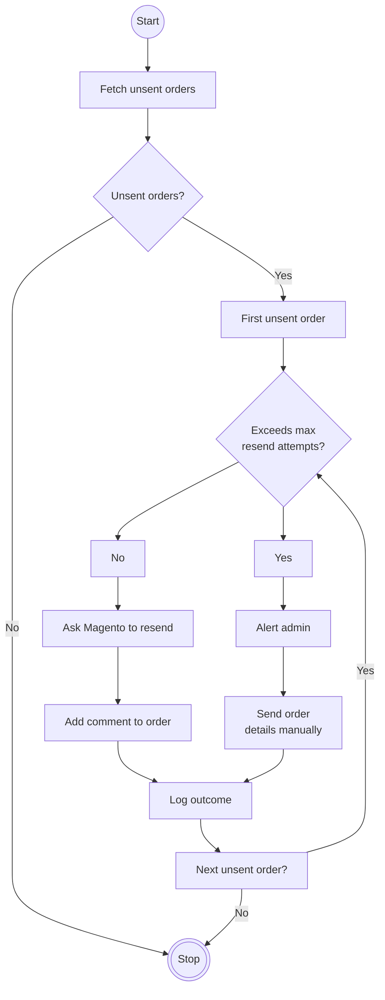

# OrderEmailResender
Poll the Magento API for unsent orders, check their comments to see if attempts have been made to resend (within a threshold) and either uses the API to trigger a resend or alerts admin and sends a backup email to the sales inbox with details.

## The Problem
Magento silently fails to send asynchronous order emails occassionally. Logging is not helpful without extensive and expensive extra modules or mail servers for log monitoring.

## This Script
This script attempts to resolve the problem by adding resilience to the order email sending by using Magento's own API to resend the order emails and if that fails multiple times the order details can be manually sent to the sales team.

### Program Flow

