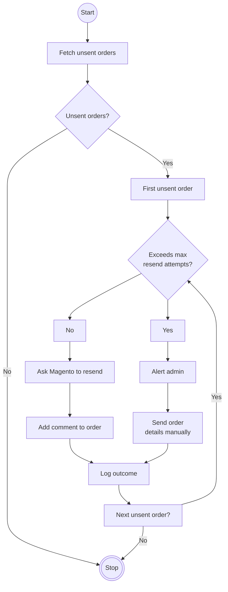

# OrderEmailResender
Poll the Magento API for unsent orders, check their comments to see if attempts have been made to resend (within a threshold) and either uses the API to trigger a resend or alerts admin and sends a backup email to the sales inbox with details.

